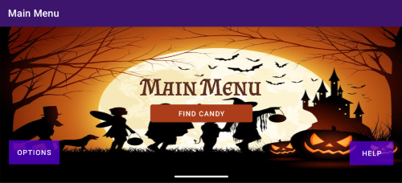
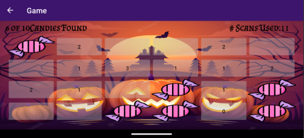

# MineSeeker-Game

## Description
MineSeeker is a halloween themed responsive Android game programmed in Java using Android Studio. It's similar but oposite to the popular game called Minesweeper, but instead of trying to avoid the mines, you seek them.
If you aren't aware of minesweeper, here is an explanation. The playing field of the game is a customizable grid of unrevealed squares and your goal is to find all of the mines which are randomly hidden behind the squares.
Squares can be revealed by tapping on them and are either a mine, or a hint. The hint is a number which represents the UNFOUND mines in the row AND column of the square (which was revealed).
This is a useful hint because in many scenarios it gives the player an idea of where the mines could be. The most important thing to note is that the occurrence of a square reveal which is not a mine, counts as a scan and the number of scans performed is tracked.
Your goal is to find all mines using the least number of scans. The lower the number of scans one takes to find all of the mines, the more skilled they are and vice versa. What makes the game interesting is that the size of the grid and the number of mines to be found can be adjusted, making the game easier with more mines and harder with less mines.

## Implementation

Logic:

Using OOP, I implemented 2 classes:

- BoardElement: Represents a single square in the grid of squares. Contains 3 attributes - an isMine, its hint value, and its 
current status (revealed & non-mine, unrevealed & non-mine, revealed & mine, or unrevealed & mine)
- Board: This class represents the full board displayed in the game via a 2d array of BoardElements. The other attributes it contains are 
rows, columns, number of mines, num of mines found, num of scans used.

UI:

I have used 5 activities to construct this app:

- MainActivity: The main initial page of the application containing an animation of fade in and rotate with an option to skip the animation. If animation is not skipped
automatically advances to the main menu after 4 seconds

- MainMenu: Main menu consisting of an options button, a help button, and a play game button. Any settings selected in options are changed accordingly in the game.

- Options: Containing two radio button lists of board sizes and number of mines hidden in the board passes these values to PlayGame accordingly using SharePreferences.

- PlayGame: UI of the game itself. Each click on the button results in a check of the status of the boardelement clicked which then reveals either a mine or scan information accordingly. If element is already scanned, nothing happens.

- Help: States the way to play the game while expressing the theme as much as possible. Contains link to course website and to all images used in the project

## Setup Requirements
- Install the latest version of Android Studio
- Install the latest version of the Software Development Kit
- Set up an emulator on Android Studio (API >= 27, any phone)
- Run the app (emulator must be API 27-33)

## How to Use

Options:

This is the place where you can change the size of the grid and the number of mines. 
- Size Options: 4 rows x 6 columns, 5 rows x 10 columns, 6 rows x 15 columns
- Mine Options: 6 mines, 10 mines, 15 mines, 20 mines

Find Candy:

Begins the game with a grid of unreveal squares as chosen in Options.
There is no time limit so the player may take as long as needed to make their decisions. 
See [Screenshots](Screenshots) for a demo run.

Help: 

This page consists of instructions on how the game works as well as references to the backgrounds used in the app.

## Screenshots

Example run of a game:

## License
MIT
